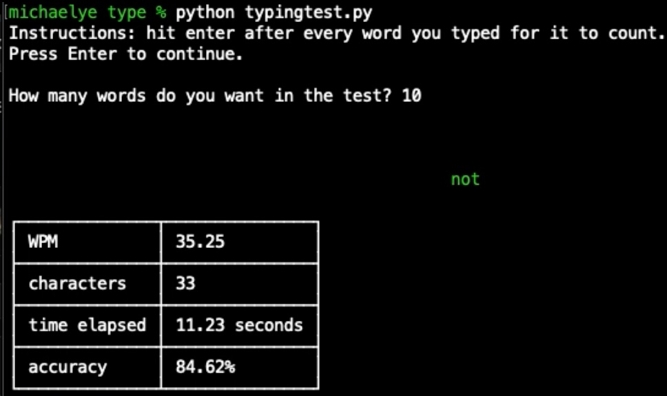

This python script is a command line typing test that measures your typing speed using a subset of the 200 most common English words. Manipulates the command line using ANSI escape codes to keep the prompts in place (no new lines) and displays the correctness of typed words using colors.

Here is a video that shows how the program runs: .

https://github.com/MichaelYe48/Typing-Test/assets/103202988/e8727612-44ef-41df-994d-4dc64354b298

